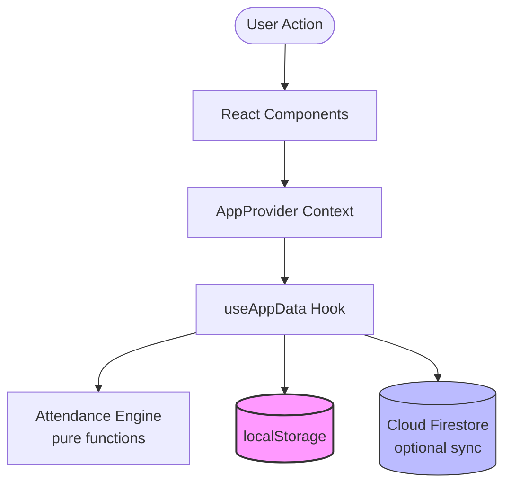
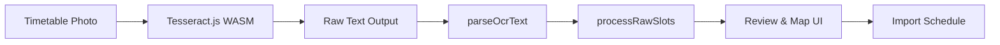

# Attendly

### **Make informed academic decisions. An offline-first, mobile-optimized college attendance companion.**

[]()
[]()
[](LICENSE)
[]()

---

## 🚀 Project Highlights

*   **Production Tested:** Active user base of ~20 students across 3 academic semesters.
*   **Offline-First & Installable:** Progressive Web App (PWA) that loads instantly and runs entirely offline.
*   **Local-First OCR:** Scan and parse printed university timetables locally in-browser using Tesseract.js.
*   **Pure Attendance Engine:** 100% pure function architecture for attendance logic, isolated from database and framework side-effects.
*   **Comprehensive Test Suite:** 47 automated Vitest unit tests verifying calculations and parser edge cases.
*   **Optional Firebase Sync:** Synchronize across multiple devices with real-time cloud backup, only if signed in.
*   **Strict Security Boundaries:** Data persistence, backup uploads, and OCR outputs validated using Zod.

---

## 📌 The Problem

In many universities, attendance tracking remains analog— professors record attendance on physical registers, leaving students guessing their actual status.

Students are forced to mentally calculate percentages, guess how many classes they can skip, or manage schedules in messy text files. 

**Attendly solves this single problem.** It provides an installable mobile dashboard that tells students exactly where they stand, how many classes they can safely miss, or how many consecutive classes they must attend to recover their percentage.

---

## 🛠️ System Architecture

Attendly is designed as a **client-side-first** application. All core state changes and calculations occur locally in the user's browser, with optional real-time cloud synchronization.



### The OCR Timetable Pipeline

The OCR pipeline runs entirely on the client, enabling offline schedule imports without backend costs or API keys.



---

## ✨ Features

### 📅 Schedule & Session Management
- **Timetable Scanner:** Import schedule instantly by uploading an image of your printed timetable.
- **Rescheduling & Postponing:** Shift individual classes to other dates. The system tracks rescheduled sessions as `OneOffSlots` linked to original weekly classes.
- **Semester Archival:** Reset the dashboard for a fresh semester while preserving historical data.

### 📈 Smart Attendance Insights
- **Color-Coded Statuses:** Log sessions as **Attended**, **Absent**, **Cancelled**, or **Postponed** with a single tap.
- **Safe-to-Miss Math:** Know exactly how many classes you can skip while remaining above your college's minimum attendance threshold (e.g., 75%).
- **Classes Needed:** If you drop below the threshold, the app calculates the exact number of consecutive classes you must attend to recover.
- **Historical Bridging:** Enter prior attendance credits manually if you started tracking midway through a semester.

---

## 🧠 Core Engineering Highlights

### 1. Pure Function Attendance Engine
All attendance calculations are isolated in [`src/lib/attendanceEngine.ts`](src/lib/attendanceEngine.ts). 
*   **Predictable Calculations:** The module contains no React state or DOM dependencies. It relies entirely on input arguments, making it **100% predictable and unit-testable**.
*   **Credit-Weighting:** Instead of counting raw class numbers, calculations use **credits** (e.g., Labs count as 3 credits, lectures count as 2). The attendance percentage represents:
  $$\text{Attendance \%} = \frac{\text{Attended Credits}}{\text{Conducted Credits}} \times 100$$
*   **Automatic Filtering:** Excludes holidays, Sundays, cancelled classes, and records logged before the tracking start date.

### 2. Offline-First Design
*   **localStorage Primary:** State changes are persisted to `localStorage` immediately.
*   **Conflict-Free Sync:** Firestore sync is optional and non-blocking. It uses a `hasPendingWrites` metadata guard to ignore local echoes, preventing synchronization write loops.
*   **PWA Asset Cache:** Web assets and web fonts are cached via custom service workers configured in `next.config.ts`.

### 3. Deterministic OCR Parser
*   **Adaptive Row Splitting:** Splits grid layout columns based on double spaces if formatting is preserved, falling back to single-space parsing when lines are compressed.
*   **Token Combiners:** Custom combiners merge multi-word subjects (e.g., `AAP` + `LAB` + `1` $\rightarrow$ `AAP LAB 1`) to preserve timetable naming.
*   **OCR Error Corrector:** Translates digit-substitution errors (e.g., `M0N` $\rightarrow$ `MON`, `T11E` $\rightarrow$ `TUE`).
*   **Punctuation Filter:** Automatically discards vertical pipes and brackets generated by table borders.

### 4. Zod Validation Boundaries
All data crossing trust boundaries is validated with schemas in [`src/lib/schemas.ts`](src/lib/schemas.ts).
*   **Compatibility:** Schema definitions use Zod `.default()` and `.nullish()` to automatically backfill missing properties when importing older storage formats.
*   **Boundaries:** local storage, Firestore snapshot sync, and manual file imports are verified prior to loading.

---

## 💾 Data Model

The data model keeps memory consumption low and runs local database state on a clean relation:

| Entity | Description | Key Fields |
|---|---|---|
| **`Subject`** | Represents a course. | `id`, `name`, `type` (Lecture / Lab) |
| **`TimeSlot`** | A recurring weekly class. | `day`, `startTime`, `endTime`, `subjectId`, `credits` |
| **`OneOffSlot`** | A rescheduled class for a specific date. | `date`, `originalSlotId` (pointing to the base TimeSlot) |
| **`AttendanceRecord`** | Logs attendance for a slot on a specific date. | `date`, `slotId`, `status` (Attended / Absent / Cancelled / Postponed) |
| **`HistoricalData`** | Credits conducted prior to using the app. | `conductedCredits`, `attendedCredits` |
| **`ArchivedSemester`** | A snapshot index of a completed semester. | `name`, `archivedAt`, `subjects[]`, `attendance[]` |

---

## 🎛️ Technology Stack

*   **Core Framework:** React 18, Next.js 15 (App Router)
*   **Language:** TypeScript
*   **OCR Pipeline:** Tesseract.js (Client-side WASM compilation)
*   **Styling:** Tailwind CSS, ShadCN UI
*   **Data Validation:** Zod
*   **Local Storage:** Native Web Storage API (`localStorage`)
*   **Cloud Layer:** Firebase Client SDK (Auth & Firestore)
*   **Testing:** Vitest

---

## 🚀 Getting Started

### Installation

1. Clone the repository and install dependencies:
   ```bash
   git clone https://github.com/yourusername/attendly.git
   cd attendly
   npm install
   ```

2. Set up environment variables (Optional — only required for Cloud Sync):
   Create a `.env.local` file at the root:
   ```env
   NEXT_PUBLIC_FIREBASE_API_KEY=your_key
   NEXT_PUBLIC_FIREBASE_AUTH_DOMAIN=your_domain
   NEXT_PUBLIC_FIREBASE_PROJECT_ID=your_id
   NEXT_PUBLIC_FIREBASE_STORAGE_BUCKET=your_bucket
   NEXT_PUBLIC_FIREBASE_MESSAGING_SENDER_ID=your_sender_id
   NEXT_PUBLIC_FIREBASE_APP_ID=your_app_id
   ```

3. Run the development server:
   ```bash
   npm run dev
   ```
   Open `http://localhost:9002` in your browser.

---

## 🧪 Testing

We maintain **47 unit tests** powered by **Vitest** that cover all pure mathematical functions in the Attendance Engine and token resolution in the OCR parser.

Run the test suite:
```bash
npm test
```

Check code coverage:
```bash
npm run test:coverage
```

---

## 📖 Architecture Reference

For a deep engineering dive into state transitions, Firestore snapshot syncing rules, double-reschedule invariants, and edge-case testing, please read [`docs/ARCHITECTURE.md`](docs/ARCHITECTURE.md).

---

## 🎓 Lessons Learned

1. **Building for Real Users:** Tracking data over multiple semesters showed the need for strict database validations. We introduced Zod boundaries to prevent invalid storage loads or malformed manual imports from crashing the app.
2. **Offline-First Synchronization:** Synchronizing local changes with a cloud backup database without creating echoes is hard. Using strict metadata checks (`hasPendingWrites`) was necessary to ensure local updates were not duplicated.
3. **Intentional Scope Limitation:** Keeping Attendly restricted strictly to attendance calculations (rather than adding assignments or calendars) kept the app lightweight, fast, and free of backend hosting costs.

---

## 📄 License

Distributed under the MIT License. See `LICENSE` for more information.
